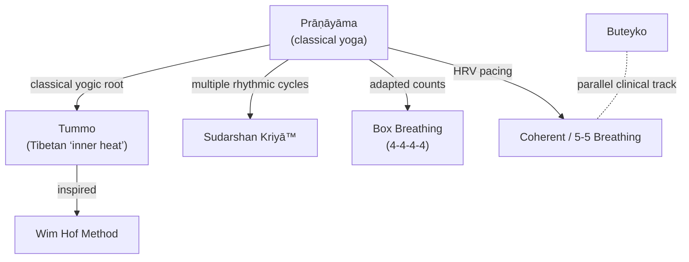

import { InfoBox } from "/snippets/infobox.mdx";

Let's start with the obvious: breathing is not exactly new. As a concept, it's about 600 million years old, and if you're reading this, you're probably already fairly adept at it.

The _work_ in breathwork implies a disciplined, intentional, focused engagement with breathing. The label _breathwork_ is new-ish, it emerged in the 1970s as part of the Human Potential Movement in California. However, Yogic Prāṇāyāma, Taoist breathing, and shamanic rituals across numerous cultures recognized breath as a bridge between body, mind, and spirit:

In this compendium though we're mostly studying western breathwork methods developed in the 1970s and 1980s, which all fall under the umbrella of Conscious Connected Breath. It’s a type of active breathwork where people are guided to breathe faster and deeper than usual, in a smooth, continuous rhythm—no pauses between inhaling and exhaling. Each breath is taken deep into the belly, and the exhale happens either naturally by just letting the diaphragm relax, or actively by contracting the diaphragm. 

This style of breathing has been used in various structured ways in the West since the late 1960s. You might’ve heard of it in methods like *Rebirthing* by Leonard Orr and Sondra Ray, *Holotropic Breathwork* developed by psychiatrist Stanislav Grof and his wife Christina, or *Reichian breathwork*, based on the ideas of Wilhelm Reich, a student of Freud.

Most of these breathwork styles combine deep, full-body breathing with music or other soundscapes. People usually lie down or sit comfortably and are encouraged to let go — moving, sounding, or expressing themselves however they need to during the session. The aim is to create a sense of safety where participants can freely release whatever emotions or physical sensations come up.

<Warning >
Depending on the method, breathwork facilitators may make all kinds of claims about the effects of the breathwork. Many of them have no scientific basis, and are at best pseudoscientific, and at worst dangerous if they make unfounded therapeutic claims.

While I do believe that breathwork can have a  positive effect on one's mental health,tThis guide makes absolutely no therapeutic claims. I simply want to provide evidence for the effects breathwork does demonstrably have and explanations for _why_ it has those effects.
</Warning>