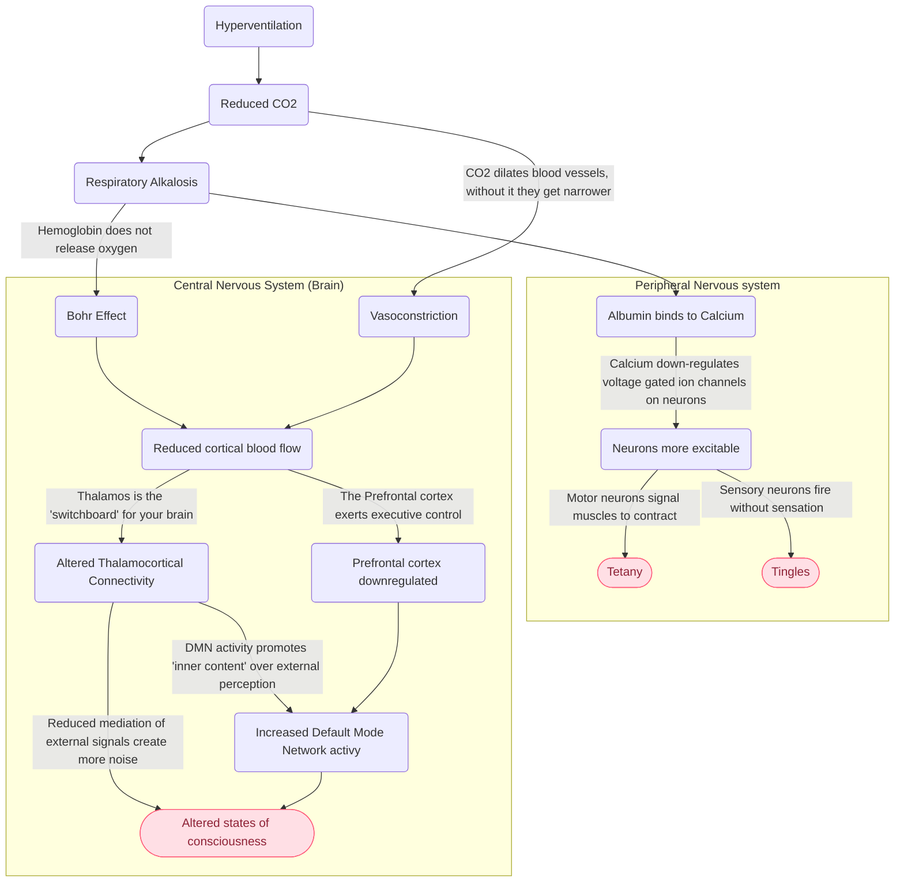

It is assumed, but not well-studied, that the psychological effects of conscious connected breath directly or indirectly stem from hypoxia. Unfortunately, the mechanisms are not well known, mostly due to before-mentioned experimental limitations.
Effect on different brain regions

Hypoxia disrupts the balance of both excitatory and inhibitory neurotransmitters (the bouncers of our neuron clubs), which has a very complex effect on different parts of the brain — some tend to be more excitable during hypoxia, some less.

The hippocampus (involved in memory formation) and reticular activating system (involved in maintaining consciousness) both initially get more excited as a response to hypoxia, even though prolonged hypoxia (way beyond the duration and intensity of common breathwork) can lead to cell damage and death in these regions.

While the exact mechanisms are unknown, this change in activity in some brain regions is known as an altered state of consciousness, modulating our awareness of both self, our thoughts and emotions and reality around us.

<Accordion title="Hypoxia and Energy" icon="lightbulb">
During hypoxia, cells don’t have enough oxygen to convert glucose into ATP (the brain’s battery packs). However, that doesn’t mean that the brain’s power is immediately shut off.

First, cells switch to a process of generating energy that doesn’t require oxygen (aptly called anaerobic metabolism), which breaks down glucose first into lactate (the ionized form of lactic acid — the two are often used interchangeably but aaaakchually different), which produces a small amount of ATP.

Side note in a side note: feeling the burn? That’s lactate produced by your poor little oxygen deprived cells — same thing that happens when you exercise. The body will gradually clear it up when hypoxia stops.

The anaerobic metabolism is a lot less efficient than using oxygen (only 2 ATP molecules per glucose molecule, compared to 36 ATP molecules when we use oxygen) and can’t be sustained for long periods, but it’s something. Hence the effects of hypoxia are not linear but can change a lot based on time, but also general health and age of the subject.
</Accordion>

## Dopamine response

Animal studies have shown that hypoxia can lead to increased dopamine release, and decreased reuptake of dopamine. Dopamine is an important neurotransmitter that has been shown to play a crucial role in how we feel pleasure, plan, focus, and even find things interesting.

## Endorphin release

It is theorized that hypoxia triggers a release of β-endorphin, an endogenous opioid that binds to the same receptors as morphine and codeine. Like other opioids, endorphins can inhibit the transmission of pain signals and create a feeling of euphoria. It’s also released during intense prolonged exercise, where it’s known as “runner’s high”.
Again, the bad news is that nobody knows the exact mechanism of either process.

# Subjective effects

[Bahi et al, 2023](https://link.springer.com/article/10.1007/s12144-023-05119-6) did one of the first neuropsychological studies specifically on conscious connected breath. Among other things, they compared the subjective effect of breathwork to the perceived effect of psilocybin using the well-established “11 Dimension Altered State of Consciousness Questionnaire”. Essentially, they asked subjects a number of questions after a breathwork session that map to eleven different “dimensions” of altered states. In the chart below you can compare the effect they found after conscious connected breath (red line) compared to a study of psilocybin (blue lines, the darker the line the stronger the dose). As you can see, breathwork produced a similar subjective effect on eg. insightfulness, experience of unity as 400μg psilocybin per kg of body weight (which for a person weighing 70 kg works out to about 3.5g ± 1 of dried magic mushrooms, Psilocybe cubensis), while producing noticeably less visual imagery.

<Frame caption="Comparison of subjective effects of conscious connected breath and psilocybin">

</Frame>

# Overview over known mechanisms

